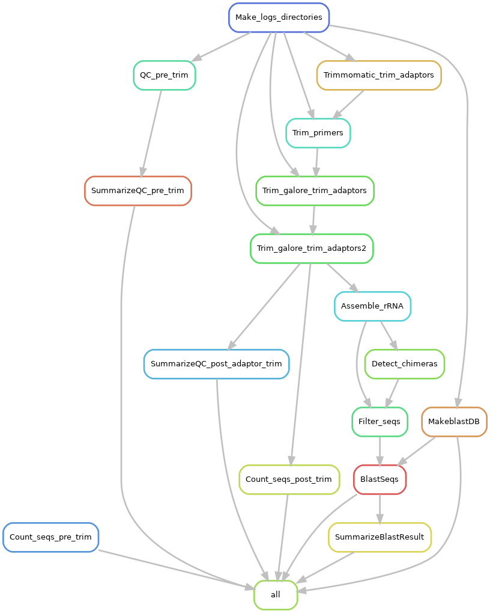

# Snakemake workflow: Assembly of near full length 16S rRNA sequences
The workflow assembles and annotates near full length 16S rRNA illumina sequences using spades or megahit, drops chimeric contigs and contigs less than 1000bp, and annotates the assembled 16S sequences against a chosen 16S database e.g SILVA database using BLAST. 

I will be be happy to fix any bug that you might find, so please feel free to reach out to me at obadbotanist@yahoo.com or initiate a pull request.

Please do not forget to cite the authors of the tools used.

**The Pipeline does the following:**

- Quality checks, summarizes and counts the input reads using FASTQC, MultiQC and seqkit
- Trims off primers and adapters using a combination of Trimmomatic and Trimgalore
- Quality checks, summarizes and counts the trimmed reads using FASTQC, MultiQC and seqkit
- Assembles the clean reads using either spades or megahit
- Detects Chimeric contigs using Usearch
- Drops Chimeric sequences and sequences less than 1000bp, since full length 16S rRNA sequences should be longer 
- Annotates the full length 16S rRNA sequences using BLAST

## Authors

* Olabiyi Obayomi (@olabiyi)

Before you start, make sure you have all the required software installed. You can optionally install my [bioinfo environment](https://github.com/olabiyi/snakemake-workflow-qiime2/blob/main/envs/bioinfo.yaml) which contains snakemake and many other useful bioinformatics tools.

- miniconda
- snakemake
- multiqc
- fastqc
- parallel
- trim_galore
- cutadapt
- trimmomatic
- seqkit
- blast
- spades
- megahit
- usearch

Please see the README file [here](https://github.com/olabiyi/snakemake-workflow-qiime2/tree/main#readme) for more details on how to install miniconda, snakemake and my bioinfo environment.
